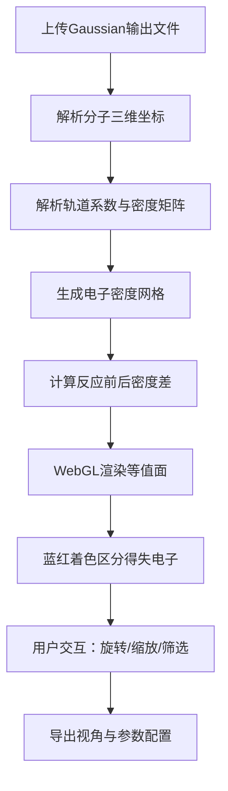

## 1. 产品概述

面向计算有机化学研究人员的桌面端分子轨道可视化工具，专注于Gaussian量化计算输出文件的解析与三维渲染，通过WebGL技术实现电子密度差分等值面的交互式展示，助力化学反应机理分析与电子转移过程研究。

## 2. 核心功能

### 2.1 用户角色
| 角色 | 注册方式 | 核心权限 |
|------|---------|----------|
| 科研人员 | 本地应用无需注册 | 解析日志、渲染轨道、导出配置、全屏查看 |

### 2.2 功能模块
1. **主应用页面**：三栏式布局，左侧文件上传与分子切换，中央3D渲染画布，右侧原子筛选面板
2. **Gaussian日志解析模块**：读取分子三维坐标、轨道系数、电子密度网格数据
3. **电子密度差分渲染模块**：WebGL等值面渲染，蓝红区分电子得失区域
4. **分子交互控制模块**：拖拽旋转、滚轮缩放、片段显隐
5. **原子基团筛选模块**：按原子类型、基团、残基筛选高亮
6. **参数导出模块**：保存视角与网格精度配置为JSON

### 2.3 页面详情
| 页面名称 | 模块名称 | 功能描述 |
|---------|---------|---------|
| 主应用页面 | 文件上传栏 | 拖拽或点击上传Gaussian .log/.out文件，多文件队列管理 |
| 主应用页面 | 分子切换控制 | 反应物/产物/中间体切换，分子片段独立显示控制 |
| 主应用页面 | 3D渲染画布 | WebGL渲染分子结构、轨道等值面，支持交互操作 |
| 主应用页面 | 原子筛选面板 | 按元素类型、基团筛选，高亮显示选中原子 |
| 主应用页面 | 渲染参数控制 | 等值面值调节、透明度控制、着色方案切换 |
| 主应用页面 | 配置导出 | 导出当前视角、渲染参数为JSON配置文件 |

## 3. 核心流程

用户上传Gaussian计算输出文件 → 系统解析分子坐标与电子密度数据 → 切换反应物/产物视图 → 生成电子密度差分网格 → 渲染蓝红等值面 → 拖拽旋转调整视角 → 筛选高亮特定原子基团 → 导出当前配置

## 4. 用户界面设计

### 4.1 设计风格
- **主色调**：浅灰系列（#F5F5F5, #E0E0E0, #BDBDBD），科研极简风格
- **强调色**：电子得区深蓝色（#1565C0），电子失区深红色（#C62828）
- **按钮样式**：细边框、浅灰背景、圆角2px，悬停微亮
- **字体**：JetBrains Mono 作为代码展示，Inter 作为界面文本
- **布局风格**：三栏式固定布局，细分割线，无冗余装饰
- **图标风格**：线性简约图标，16×16px，灰色调

### 4.2 页面设计概述
| 页面名称 | 模块名称 | UI元素 |
|---------|---------|--------|
| 主应用页面 | 左侧控制栏 | 280px宽度，文件拖放区、分子列表、渲染参数滑块 |
| 主应用页面 | 中央渲染区 | 自适应宽度，WebGL画布、悬浮工具栏（重置视角/全屏/截图） |
| 主应用页面 | 右侧筛选面板 | 240px宽度，原子类型复选框、基团列表、高亮颜色选择 |
| 主应用页面 | 底部状态栏 | 显示当前分子信息、原子数、网格精度、FPS |

### 4.3 响应式
- Desktop-first 设计，最小支持分辨率 1280×800
- 窗口缩小时左右面板可折叠为图标侧边栏
- 移动端适配为上下布局（控制区在上，渲染区在下）

### 4.4 3D场景指导
- **环境光**：柔和半球光 + 两盏方向光，避免过强阴影
- **材质**：Phong材质，分子球棍模型使用半透明质感
- **等值面材质**：AdditiveBlending 加法混合，透明度0.6，蓝红双色
- **相机设置**：PerspectiveCamera，初始距离根据分子大小自动调整
- **交互**：OrbitControls 拖拽旋转、滚轮缩放、右键平移
- **后处理**：FXAA抗锯齿，轻微晕影增强科研感
- **性能优化**：InstancedMesh 渲染原子球体，LOD控制细节层级
