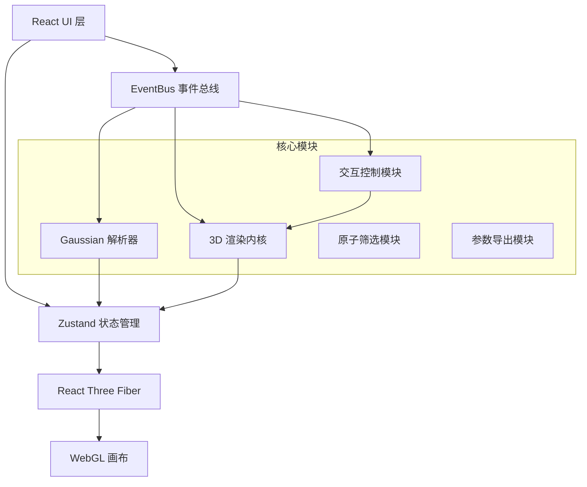

## 1. 架构设计



## 2. 技术描述

- **前端框架**：React@18 + TypeScript@5 + Vite@5
- **3D 渲染**：three@0.160 + @react-three/fiber@8 + @react-three/drei@9 + @react-three/postprocessing@2
- **状态管理**：zustand@4
- **样式方案**：tailwindcss@3
- **事件总线**：mitt@3
- **等值面生成**：使用 Marching Cubes 算法，通过 three.js 的 MarchingCubes 类实现
- **数学计算**：自定义矩阵运算与密度网格计算模块

## 3. 目录结构

```
src/
├── components/
│   ├── LeftPanel/          # 左侧控制栏
│   │   ├── FileUpload.tsx  # 文件上传组件
│   │   ├── MoleculeList.tsx # 分子列表切换
│   │   └── RenderParams.tsx # 渲染参数控制
│   ├── CenterCanvas/       # 中央3D画布
│   │   ├── Scene3D.tsx     # R3F场景组件
│   │   ├── MoleculeMesh.tsx # 分子网格渲染
│   │   ├── DensityIsosurface.tsx # 密度等值面
│   │   └── Toolbar.tsx     # 悬浮工具栏
│   └── RightPanel/         # 右侧筛选面板
│       ├── AtomFilter.tsx  # 原子类型筛选
│       ├── GroupFilter.tsx # 基团筛选
│       └── HighlightSettings.tsx # 高亮设置
├── core/
│   ├── parser/             # Gaussian 解析器
│   │   ├── GaussianParser.ts
│   │   └── types.ts
│   ├── renderer/           # 3D 渲染内核
│   │   ├── DensityGrid.ts  # 电子密度网格
│   │   ├── Isosurface.ts   # 等值面生成
│   │   └── DensityDiff.ts  # 密度差分计算
│   ├── controls/           # 交互控制
│   │   ├── OrbitControls.ts
│   │   └── MoleculeSwitcher.ts
│   ├── filter/             # 原子筛选模块
│   │   └── AtomSelector.ts
│   ├── export/             # 参数导出
│   │   └── ConfigExporter.ts
│   └── events/             # 事件总线
│       └── EventBus.ts
├── store/
│   └── useMoleculeStore.ts # Zustand 状态管理
├── types/
│   └── index.ts            # 全局 TS 类型定义
├── config/
│   └── materials.ts        # 分子材质着色配置
├── utils/
│   ├── math.ts             # 数学工具
│   └── color.ts            # 颜色工具
├── App.tsx
├── main.tsx
└── index.css
```

## 4. 模块职责说明

### 4.1 Gaussian 日志解析器 (`core/parser/`)
- 解析 `.log`/`.out` 文件格式
- 提取分子三维坐标（原子符号 + XYZ坐标）
- 解析分子轨道系数与基组信息
- 提取密度矩阵或电子密度网格数据
- 支持多步反应的多结构解析

### 4.2 电子密度差分 3D 渲染内核 (`core/renderer/`)
- `DensityGrid.ts`：三维网格数据结构，密度值插值计算
- `DensityDiff.ts`：计算反应前后电子密度差（Δρ = ρ_产物 - ρ_反应物）
- `Isosurface.ts`：Marching Cubes 等值面生成，顶点法向量计算
- 支持多精度网格（粗/中/细），可动态切换

### 4.3 分子结构切换控制模块 (`core/controls/`)
- 反应物/产物/中间体多状态管理
- 分子片段独立显隐控制
- 视角自动对齐与过渡动画
- 支持同步/异步视图切换

### 4.4 原子基团筛选高亮模块 (`core/filter/`)
- 按元素周期表类型筛选（C, H, O, N, S, P, F, Cl, Br, I 等）
- 内置官能团识别（羟基、羰基、苯环、氨基等）
- 选中原子高亮：外发光效果 + 颜色叠加
- 支持框选/点选交互

### 4.5 差分参数导出模块 (`core/export/`)
- 导出当前相机视角参数（position, target, up）
- 导出等值面配置（等值面值、透明度、颜色映射）
- 导出网格精度设置与筛选状态
- JSON 格式，支持导入恢复

### 4.6 组件事件总线 (`core/events/`)
- 跨组件事件通信，避免 props 层层传递
- 核心事件：`FILE_UPLOADED`, `MOLECULE_CHANGED`, `VIEW_CHANGED`, `FILTER_UPDATED`, `ISO_VALUE_CHANGED`
- 类型安全的事件 payload

## 5. 全局类型定义（`types/index.ts` 预览）

```typescript
// 原子数据结构
interface Atom {
  id: number;
  element: string;
  symbol: string;
  position: Vector3;
  atomicNumber: number;
  group?: string;
}

// 分子结构
interface Molecule {
  id: string;
  name: string;
  type: 'reactant' | 'product' | 'intermediate';
  atoms: Atom[];
  bonds: Bond[];
  molecularFormula: string;
  charge: number;
  multiplicity: number;
}

// 电子密度网格
interface DensityGrid {
  dimensions: [number, number, number];
  origin: Vector3;
  spacing: Vector3;
  data: Float32Array;
  unit: string;
}

// 渲染配置
interface RenderConfig {
  isoValue: number;
  positiveColor: string;
  negativeColor: string;
  opacity: number;
  gridResolution: 'coarse' | 'medium' | 'fine';
  showBonds: boolean;
  showAtoms: boolean;
  atomStyle: 'ball' | 'stick' | 'ballstick';
}

// 视角配置
interface ViewConfig {
  cameraPosition: [number, number, number];
  cameraTarget: [number, number, number];
  cameraUp: [number, number, number];
  fov: number;
}
```

## 6. 分子材质着色配置（`config/materials.ts` 预览）

```typescript
// 原子色（CPK配色标准）
export const ATOM_COLORS: Record<string, string> = {
  H: '#FFFFFF',
  C: '#909090',
  N: '#3050F8',
  O: '#FF0D0D',
  F: '#90E050',
  Cl: '#1FF01F',
  Br: '#A62929',
  I: '#940094',
  S: '#FFFF30',
  P: '#FF8000',
  // ... 更多元素
};

// 原子半径（用于球棍模型）
export const ATOM_RADII: Record<string, number> = {
  H: 0.31,
  C: 0.76,
  N: 0.71,
  O: 0.66,
  // ...
};

// 密度差分着色方案
export const DENSITY_MATERIALS = {
  positive: {
    color: '#1565C0',
    transparent: true,
    opacity: 0.6,
    side: THREE.DoubleSide,
    blending: THREE.AdditiveBlending,
    depthWrite: false,
  },
  negative: {
    color: '#C62828',
    transparent: true,
    opacity: 0.6,
    side: THREE.DoubleSide,
    blending: THREE.AdditiveBlending,
    depthWrite: false,
  },
};
```

## 7. 性能优化策略

1. **InstancedMesh 渲染原子**：100+原子使用实例化网格，减少Draw Call
2. **Web Worker 解析与计算**：文件解析、密度差分计算在Worker线程执行
3. **LOD 细节层次**：根据距离自动切换原子模型精度
4. **网格数据复用**：反应物/产物共用基础网格，仅计算差值
5. **帧缓冲优化**：使用WebGL2的VAO和UBO，减少状态切换
6. **按需渲染**：仅在交互或参数变化时重绘，空闲时暂停渲染
7. **TypedArray 优化**：所有几何数据使用 Float32Array，避免GC压力
